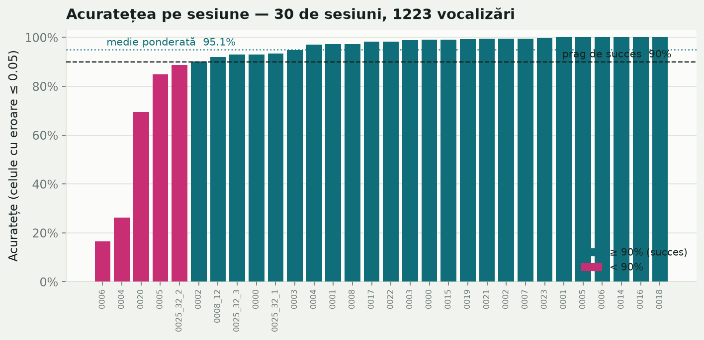
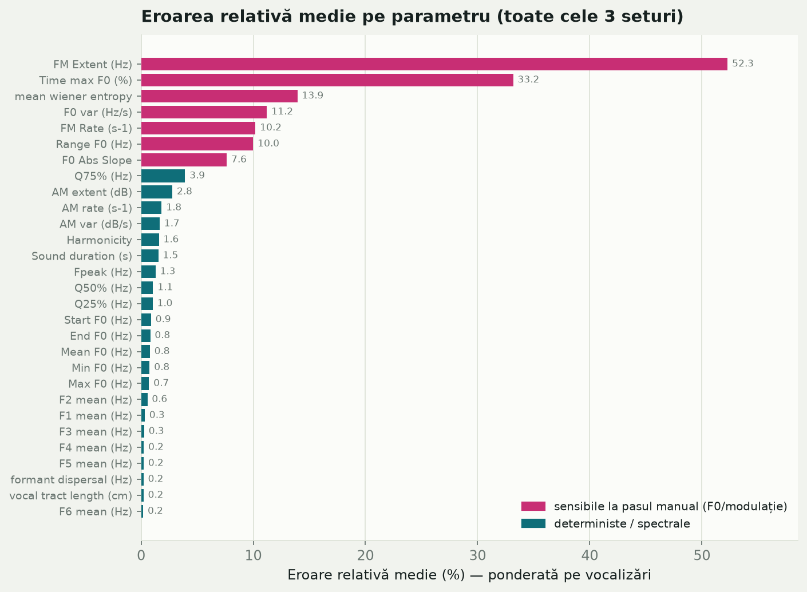

# Documentație — `bovine_acoustics.py`

Analiză acustică a vocalizărilor bovine (viței și vaci), reimplementare în
Python/`parselmouth` a fluxului manual din Praat descris de macro-urile
`Script calves MPT Ello` și `Script cows MPT Ello.txt`.

> **Unealtă internă de cercetare, nu un produs.** Scriptul este folosit intern
> pentru analiza vocalizărilor și nu este destinat distribuirii ca produs.

---

## 1. Scop

Aplicația este folosită de cercetători din domeniul veterinar și al acusticii
pentru a analiza comportamentul animalelor pe baza înregistrărilor audio.
Scriptul parcurge automat un director cu fișiere audio, calculează un set de
parametri acustici pentru fiecare vocalizare și exportă rezultatele într-un
tabel (`.csv` și, opțional, `.xlsx`).

Față de fluxul manual din Praat, scriptul adaugă un pas **automat** de curățare
a conturului de frecvență fundamentală (F0): detectează și elimină „săriturile”
de urmărire (anomalii armonice / de octavă) — pasul pe care cercetătorul îl
făcea manual în editorul de pitch din Praat („inspectează sunetul și scoate
segmentele greșite”).

---

## 2. Ce face, pe scurt

Pentru fiecare fișier audio, scriptul calculează:

- **Parametri de sursă (F0 / pitch):** media, valoarea de start/final, maximul,
  minimul, intervalul, momentul maximului, panta absolută medie, variația și
  modulația de frecvență (FM rate, FM extent).
- **Parametri de energie spectrală:** quartilele spectrale Q25/Q50/Q75 și
  frecvența de vârf (Fpeak).
- **Parametri de amplitudine (intensitate):** variația și modulația de
  amplitudine (AM var, AM rate, AM extent), plus durata sunetului.
- **Armonicitate (HNR).**
- **Formanți** (F1–F6 pentru viței, F1–F8 pentru vaci), dispersia formanților
  și lungimea estimată a tractului vocal.
- **Entropia Wiener** (planeitatea spectrală).
- **(Opțional) Durata și ora vocalizării** preluate dintr-un fișier `.tsv` de
  adnotare (coloanele `Duration(s)` și `Start`).

Fidelitatea matematică față de macro-urile Praat originale este păstrată intact;
blocurile deterministe (Q25/Q50/Q75, Fpeak, durata, entropia Wiener) reproduc
valorile de referință la nivel de rotunjire.

---

## 3. Cerințe și instalare

- Python 3.10+ (testat pe 3.12)
- Pachete: vezi `requirements.txt`

Instalare:

```bash
pip install -r requirements.txt
```

sau manual:

```bash
pip install praat-parselmouth "numpy>=2.4.4" pandas openpyxl
```

> **Important (stabilitate):** `numpy` este fixat la `>=2.4.4`. Pe `numpy 2.4.2`
> s-au observat blocări native (crash) în motorul `parselmouth` pe Windows care
> nu apăreau pe `2.4.4`. `openpyxl` este opțional — este necesar doar pentru
> exportul `.xlsx` (fișierul `.csv` se scrie oricum).

---

## 4. Utilizare de bază

Scriptul procesează **un director** de fișiere audio odată. Sunt suportate
extensiile `.wav`, `.aif`, `.aiff` și `.au`, însă **recomandarea puternică este
`.wav`** (formatul pe care a fost testat și validat scriptul).

**Viței (calf):**
```bash
python bovine_acoustics.py -i cale/catre/director -o rezultate.csv -a calf
```

**Vaci (cow)** — cu tipul de vocalizare `-c` (LFC = joasă, gură închisă;
HFC = înaltă, gură deschisă):
```bash
python bovine_acoustics.py -i cale/catre/director -o rezultate.csv -a cow -c HFC
```

Rezultatul este scris în fișierul indicat de `-o`, plus un `.xlsx` cu același
nume (dacă `openpyxl` este instalat).

> **Notă despre `-c`:** argumentul `-c/--call-type` este **obligatoriu** la orice
> rulare. La viței, analiza folosește parametri ficși (nu depinde de LFC/HFC), dar
> `-c` este folosit oricum pentru a selecta tipul corect din fișierul `.tsv`
> (vezi secțiunea 9). De aceea, când rulați pe un folder de HFC, treceți `-c HFC`
> chiar și pentru `-a calf`.

---

## 5. Argumentele liniei de comandă

| Argument | Implicit | Descriere |
|---|---|---|
| `-i`, `--input_dir` | *(obligatoriu)* | Directorul cu fișierele audio. |
| `-o`, `--output` | *(obligatoriu)* | Calea fișierului `.csv` de ieșire. |
| `-a`, `--animal` | *(obligatoriu)* | `calf` (vițel) sau `cow` (vacă). |
| `-c`, `--call-type` | *(obligatoriu)* | Tipul vocalizării: `LFC` sau `HFC`. Nu are valoare implicită. |
| `--modulation-method` | `faithful` | `faithful` (identic Praat) sau `experimental` (de validat). |
| `--wiener-method` | `faithful` | idem pentru entropia Wiener. |
| `--dispersion-method` | `faithful` | idem pentru dispersia formanților. |
| `--no-filter` | *(dezactivat)* | Oprește curățarea automată a anomaliilor F0. |
| `--filter-window` | `5` | Lungimea ferestrei pentru mediana glisantă (cadre). |
| `--filter-jump` | `30` | Pragul (Hz) al săriturii care marchează o anomalie. |
| `--filter-return-tol` | `15` | Toleranța (Hz) de revenire la linia de bază. |
| `--isolate` | *(dezactivat)* | Rulează fiecare fișier într-un subproces separat. |
| `--retries` | `10` | Câte reîncercări complete după un crash nativ. |
| `--timeout` | *(fără)* | Limită de timp per fișier (secunde), doar cu `--isolate`. |
| `--max-duration` | *(fără)* | Sare peste înregistrările mai lungi de N secunde. |
| `--mem-report` | *(dezactivat)* | Afișează memoria maximă folosită per fișier. |
| `--skip-wiener` | *(dezactivat)* | Sare peste etapa Wiener (diagnostic). |
| `--skip-formants` | *(dezactivat)* | Sare peste etapa de formanți (diagnostic). |
| `--debug` | *(dezactivat)* | Afișează urmărirea nativă (traceback) la crash. |
| `--append` | *(dezactivat)* | Adaugă la fișierul existent în loc să-l suprascrie. |

---

## 6. Structura fișierului de ieșire

Antetele reproduc exact parametrii din macro-urile Praat (`fileappend`), inclusiv
regulile de formatare zecimală (de obicei 3 zecimale; câmpuri nedefinite scrise
ca `--undefined--`).

**Viței (`-a calf`):**

```
file, Mean F0 (Hz), Start F0 (Hz), End F0 (Hz), Max F0 (Hz), Min F0 (Hz),
Range F0 (Hz), Time max F0 (%), F0 Abs Slope, F0 var (Hz/s), FM Rate (s-1),
FM Extent (Hz), Q25% (Hz), Q50% (Hz), Q75% (Hz), Fpeak (Hz), Sound duration (s),
AM var (dB/s), AM rate (s-1), AM extent (dB), Harmonicity, F1..F6 mean (Hz),
formant dispersal (Hz), vocal tract length (cm), mean wiener entropy, Comment
```

**Vaci (`-a cow`):** conține în plus coloana `Call type`, are formanți `F1..F8`
și nu conține coloanele Start/End F0, Time max, panta și modulația F0 (conform
scriptului de referință pentru vaci).

La final, dacă există un fișier `.tsv` de adnotare, se adaugă două coloane
suplimentare: **`Duration(s)`** și **`Start`** (vezi secțiunea 9).

Coloana **`Comment`** semnalează automat:
- `unvoiced` — dacă filtrul a eliminat cadre anomale din F0;
- `engine crash: ...` — dacă fișierul a fost recuperat sărind o etapă care a
  provocat un crash nativ (vezi secțiunea 10).

---

## 7. Curățarea automată a anomaliilor F0 („unvoicing” automat)

Aceasta este funcționalitatea principală adăugată față de Praat.

**Ce problemă rezolvă:** algoritmul de urmărire a pitch-ului produce uneori
„sărituri” bruște (de ex. la o octavă sau la o armonică superioară), care
denaturează statisticile F0. În Praat, cercetătorul le elimina manual.

**Cum funcționează** (`filter_f0_outliers`):
1. Se extrage conturul F0 într-un vector NumPy (cadrele nevocale = `NaN`).
2. Se calculează diferența dintre cadre consecutive: `Δf = |F0[i] − F0[i−1]|`.
3. Se calculează o **mediană glisantă** a conturului ca „linie de bază” a
   frecvenței reale.
4. Când apare o săritură `≥ --filter-jump` (implicit 30 Hz) care duce valoarea
   la peste ~30 Hz distanță de linia de bază, se marchează începutul unei
   secvențe anormale.
5. Se marchează **întreaga secvență contiguă** de cadre anormale, până când
   urmărirea revine la linia de bază (în limita `--filter-return-tol`) sau se
   termină segmentul vocal.
6. Cadrele marcate sunt eliminate; se construiește un **`PitchTier` corectat**,
   iar statisticile F0 și modulațiile sunt recalculate din el.

Detectarea se face pe conturul de pitch **brut** (înainte de netezire/
interpolare), fiindcă acolo sunt vizibile săriturile — exact ca în fluxul manual
Praat. Fișierele fără anomalii rămân identice cu rezultatul „clasic”.

Filtrarea este **activă implicit**. Se dezactivează cu `--no-filter` (util dacă
doriți reproducerea exactă a foilor de calcul vechi, nefiltrate).

---

## 8. Implementări duble: `faithful` vs `experimental`

Acolo unde macro-urile Praat conțin o particularitate matematică sau o
implementare non-standard, scriptul oferă două variante, selectabile din linia
de comandă (implicit `faithful` peste tot):

- **`faithful`** reproduce **exact** matematica din macro-urile Praat, inclusiv
  particularitățile lor. Rezultatele sunt identice cu foile de calcul istorice,
  deci comparabile cu datele deja analizate. **Aceasta este varianta care trebuie
  folosită** pentru analize reale.
- **`experimental`** este o versiune corectată matematic a acelorași metrici.
  Poate fi mai corectă teoretic, **dar nu a fost validată** — nu se știe încă
  dacă schimbarea afectează concluziile biologice.

> **De reținut:** variantele `experimental` **trebuie validate de un expert din
> domeniu** înainte de a fi folosite în analize. Până atunci, folosiți `faithful`.

Diferențele, pe metrici:

- **Modulație (pitch/intensitate)** — `--modulation-method`
  - `faithful`: reproduce bucla Praat, inclusiv particularitatea de indexare
    (limita buclei ia numărul de puncte din `PitchTier`, dar indexează cadrele
    de pitch), cu alinierea corectă între indexarea 0-based NumPy și 1-based
    Praat.
  - `experimental`: variantă vectorizată pe tot conturul valid.

- **Entropie Wiener** — `--wiener-method`
  - `faithful`: reproduce fidel `To Spectrum (dft)` și particularitatea de
    indexare a matricei de putere din macro (rezultatul se potrivește exact cu
    referința).
  - `experimental`: folosește binii reali din bandă și o medie geometrică corectă
    numeric (doar pe binii strict pozitivi).

- **Dispersia formanților** — `--dispersion-method`
  - `faithful`: media distanțelor consecutive dintre formanți (formulă
    telescopică din Praat).
  - `experimental`: panta prin regresie liniară pe (indice formant, frecvență),
    care folosește toți formanții, nu doar extremele.

---

## 9. Coloanele `Duration(s)` și `Start` (din fișierul `.tsv`)

Dacă în **directorul fișierului de ieșire** (`-o`) există un fișier `.tsv`
(numele nu contează — se caută primul `*.tsv`), scriptul adaugă la final două
coloane, preluate din el.

> **Sursa fișierului `.tsv`:** acest fișier nu este creat de acest script. El
> este rezultatul unui **alt script intern, aplicat direct în Praat**, care
> exportă intervalele adnotate (momentul și durata fiecărei vocalizări).

Structura așteptată a `.tsv` (separat prin TAB):

```
tmin	tier	text	tmax	tsec	Ora_Muget
9.265731	8_00_6	HFC	10.300537	1.034805...	08:41:29
...
```

**Maparea:**
- Se păstrează doar rândurile al căror `text` este de **tipul rulării** (LFC sau
  HFC, dat de `-c`).
- Rândurile rămân în ordinea din `.tsv` (cronologică). Al **k**-lea rând de
  acel tip este asociat fișierului `<TIP>_k` (după numărul din numele
  fișierului): primul HFC din `.tsv` → `HFC_1`, al doilea → `HFC_2` etc.
- `tsec` → coloana **`Duration(s)`** (rotunjit la 3 zecimale).
- `Ora_Muget` → coloana **`Start`** (ora exactă, copiată ca atare, ex. `08:41:29`).

**Comportament robust:**
- Dacă **nu există** niciun `.tsv`, sau nu poate fi citit, sau nu are coloanele
  așteptate: cele două coloane sunt **omise**, se afișează motivul, iar rularea
  **continuă** normal.
- Dacă numărul de rânduri de acel tip din `.tsv` **diferă** de numărul de
  fișiere (nepotrivire de număr): rândurile fără corespondent primesc
  `Duration(s)`/`Start` **goale** și se afișează un avertisment.

> **Cerință de numerotare:** fișierele trebuie să fie denumite `<TIP>_<k>`
> (ex. `HFC_1.wav`, `HFC_2.wav`, …), unde `k` este ordinea vocalizării de acel
> tip. Doar așa asocierea cu rândurile din `.tsv` este corectă.

---

## 10. Rulare robustă pe calculatoare cu resurse limitate

Analiza folosește exclusiv **CPU și memorie RAM** (motorul Praat via
`parselmouth`, plus NumPy/Pandas) — **nu** folosește placa video (GPU).

### `--isolate` — izolarea fiecărui fișier
Rulează fiecare fișier într-un **subproces separat** care se închide după
terminare. Avantaje:
- memoria este eliberată complet de sistemul de operare între fișiere (evită
  „reținerea” memoriei de către alocatorul C între fișiere);
- un fișier care blochează motorul (crash nativ) omoară doar propriul
  subproces, nu întreaga rulare.

Recomandat pe laptop-uri / mașini cu RAM puțin.

### `--retries` — reîncercări după crash nativ (recuperare completă)
Unele fișiere pot provoca un **crash nativ** (`access violation` / segfault) în
etapa de formanți din `parselmouth`. Acest crash este **nedeterminist** (depinde
de dispunerea memoriei procesului), deci simpla reluare a analizei complete într-un
proces nou reușește de obicei la o încercare ulterioară.

Cu `--isolate`, la un crash scriptul **reia analiza completă** de până la
`--retries` ori (implicit 10). Doar dacă toate încercările eșuează, se recurge
la salvarea fișierului sărind etapa problematică (formanți, apoi și Wiener), ca
rândul să apară totuși în rezultat (coloanele respective rămân `--undefined--`,
iar `Comment` notează recuperarea). Astfel:
- rularea se termină întotdeauna;
- aproape toate fișierele ajung complete (cu formanți) dacă dați suficiente
  reîncercări.

Dacă timpul nu e o problemă și vreți recuperare cvasi-sigură:

```bash
python bovine_acoustics.py -i .\HFC\ -o rezultate.csv -a calf -c HFC --isolate --retries 50
```

### `--max-duration` — protecție împotriva fișierelor foarte lungi
Sare peste orice înregistrare mai lungă decât N secunde, verificând durata din
antetul fișierului `.wav` **înainte** de a-l încărca în memorie:

```bash
python bovine_acoustics.py -i ... -o ... -a calf --max-duration 120
```

---

## 11. Depanare

- **`--mem-report`** — afișează memoria maximă folosită per fișier (cu
  `--isolate`) sau cumulativ (fără), pentru a identifica fișierele grele.
  Funcționează și pe Windows, și pe Linux/macOS.
- **`--debug`** — afișează urmărirea nativă completă (`faulthandler`) la un
  crash. Implicit este **dezactivat**: crash-urile sunt raportate pe o singură
  linie și pur și simplu reîncercate.
- **`--skip-formants` / `--skip-wiener`** — sar peste o etapă „grea” nativă. Utile
  pentru a localiza etapa care provoacă un crash sau ca soluție de rezervă
  pentru a obține restul metricilor. Coloanele sărite se scriu `--undefined--`.

Exemplu de bisectare a unei probleme:
```bash
# dacă cu --skip-formants nu mai apar crash-uri, cauza este etapa de formanți
python bovine_acoustics.py -i ... -o ... -a calf --isolate --skip-formants
```

---

## 12. Validare față de referință

### Rezultatele testării pe plaja de referință

Scriptul a fost testat pe vocalizările extrase din **58 de înregistrări `.wav`
(aproximativ 29 de ore de audio)**. Ieșirea a fost comparată cu **CSV-uri de
referință create manual**, fiecare set de o **persoană diferită**.

Din acest motiv, discrepanțele reflectă în bună măsură **variația umană dintre
adnotatori**, nu neajunsuri ale scriptului — dovadă și numeroasele sesiuni în
care practic toate celulele coincid cu referința (16 din 30 de sesiuni au peste
98%). În proiectul nostru, o acuratețe **peste 90%** este considerată un succes.

Cifre agregate pe cele 3 seturi combinate:

| Indicator | Valoare |
|---|---|
| Vocalizări evaluate | **1223** |
| Sesiuni | 30 |
| Celule numerice comparate | 35.371 |
| **Acuratețe combinată** (celule cu eroare relativă ≤ 0.05) | **95.1%** |
| Eroare relativă medie | 5.4% |
| Sesiuni ≥ 90% (succes) | 25 / 30 |
| Sesiuni ≥ 98% | 16 / 30 |



Majoritatea sesiunilor sunt peste pragul de 90%; cele câteva sub prag provin din
seturile de referință cu cea mai mare variație umană.

### Ce câmpuri sunt mai sensibile



Discrepanțele se concentrează într-un grup restrâns de parametri, toți din zona
**F0 / modulație**:

- **FM Extent** are cea mai mare eroare relativă, dar cifra este înșelătoare:
  fiind un **raport** (variația totală împărțită la numărul de cicluri de
  modulație), valoarea poate fi foarte mică, iar o diferență absolută minusculă
  produce o eroare relativă mare. În valoare absolută, diferența rămâne mică.
- **Time max F0, F0 var, FM Rate, Range F0, F0 Abs Slope** depind de pasul manual
  de „unvoicing” (subiectiv) și de mici diferențe în numărarea inflexiunilor.
- **mean wiener entropy** apare ridicat doar din cauza câtorva sesiuni-outlier;
  fiind o valoare adesea apropiată de 0, eroarea relativă se amplifică artificial.

Parametrii **deterministici și spectrali** (Q25/Q50/Q75, Fpeak, durata, AM,
armonicitate) și **formanții** (F1–F6, dispersie, VTL) au eroare relativă sub
~1% — practic identici cu referința.

### Instrumentul de comparare (`compare.py`)

`compare.py` compară un fișier de ieșire cu o foaie de referință și raportează,
pe fiecare coloană, eroarea medie/maximă și procentul de valori în toleranță.

```bash
python compare.py -orig referinta.csv -new rezultate.csv -t 0.05 -r 0.01
```

- `-t` — toleranță **absolută** (în unitățile coloanei).
- `-r`, `--rel-tolerance` — toleranță **relativă** (ex. `-r 0.01` = în 1%),
  potrivită pentru un tabel cu coloane de scări foarte diferite (F0 ~80 Hz vs
  formanți ~3000 Hz). O valoare trece dacă e în toleranța absolută **sau**
  relativă.
- Coloana `Median_Rel_Err` arată eroarea relativă mediană (indicator de
  fidelitate a traducerii).

---

## 13. Exemple uzuale

```bash
# Vițel, folder LFC, cu toate funcțiile implicite (filtrare F0 activă)
python bovine_acoustics.py -i .\0000\LFC\ -o .\0000\out_LFC.csv -a calf -c LFC

# Vițel, folder HFC, robust pe laptop (izolare + multe reîncercări)
python bovine_acoustics.py -i .\0000\HFC\ -o .\0000\out_HFC.csv -a calf -c HFC --isolate --retries 50

# Combinarea mai multor foldere într-un singur fișier (adăugare)
python bovine_acoustics.py -i .\0001\HFC\ -o .\rezultate.csv -a calf -c HFC --isolate --append

# Reproducerea exactă a rezultatelor vechi (fără filtrarea automată)
python bovine_acoustics.py -i .\0000\LFC\ -o .\out.csv -a calf -c LFC --no-filter

# Diagnostic: raport de memorie + traceback nativ la crash
python bovine_acoustics.py -i .\0000\HFC\ -o .\out.csv -a calf -c HFC --isolate --mem-report --debug
```

---

## 14. Note și limitări cunoscute

- **Formanții** pot diferi cu sub-Hz față de Praat, fiindcă `parselmouth` și
  Praat folosesc implementări interne diferite ale algoritmului Burg/LPC. Nu
  este o eroare de traducere, ci o diferență de motor.
- **Statisticile F0 pe fișierele marcate manual** nu pot fi reproduse exact:
  pasul manual de „unvoicing” din Praat este subiectiv, iar coloana `Comment` din
  referință este text liber (nu indică sigur ce fișiere au fost editate).
- **Blocurile deterministe** (Q25/Q50/Q75, Fpeak, durata, AM rate, entropia
  Wiener) reproduc referința la nivel de rotunjire (`~1e-3`).
- Crash-urile native în etapa de formanți (`0xC0000005` pe Windows) sunt o
  problemă a bibliotecii `parselmouth`/Praat, gestionată aici prin izolare și
  reîncercări; nu este o problemă de memorie.
